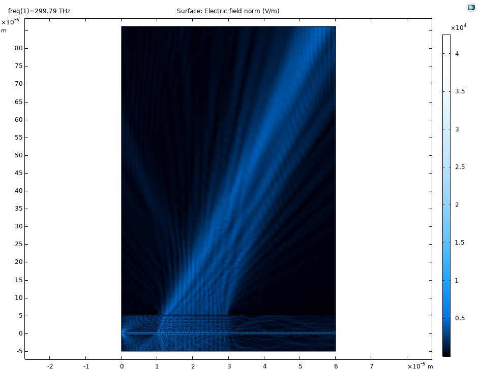
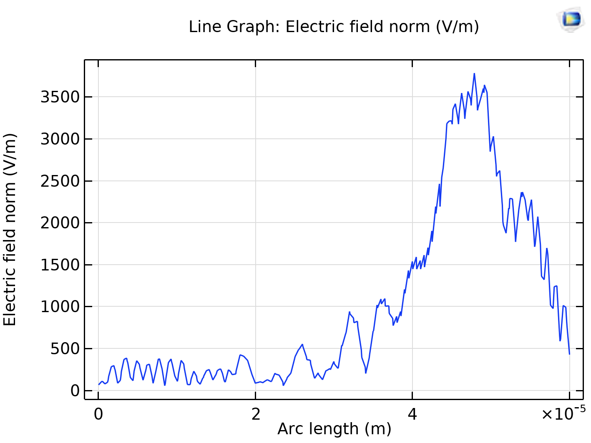
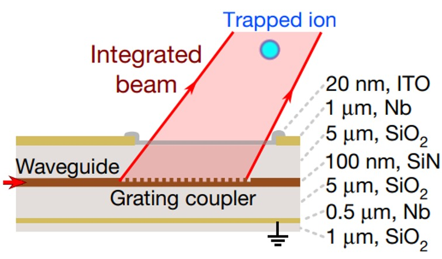

# Illuminating an ion

This is a COMSOL simulation of a waveguide coupled to an ion-trap. Light (red) passes through the waveguide and onto the diffraction grating. This results in light redirected towards the ion's location.

